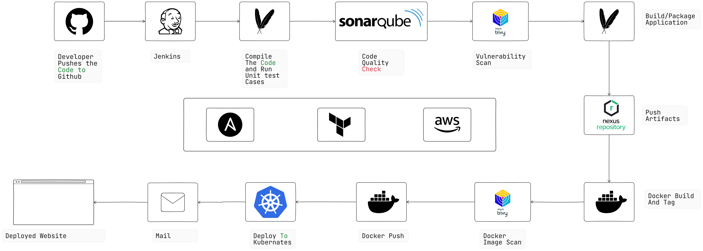

# Java Project with DevOps



## Table of Contents
- [Project Overview](#project-overview)
- [Features](#features)
- [Technologies Used](#technologies-used)
- [Setup and Installation](#setup-and-installation)
  - [Prerequisites](#prerequisites)
  - [Infrastructure Setup](#infrastructure-setup)
  - [Local Build and Run](#local-build-and-run)
  - [Docker Setup](#docker-setup)
  - [Kubernetes Deployment](#kubernetes-deployment)
- [Continuous Integration and Deployment](#continuous-integration-and-deployment)
  - [Jenkins Pipeline Overview](#jenkins-pipeline-overview)
  - [GitOps with ArgoCD](#gitops-with-argocd)
- [Project Structure](#project-structure)
- [How to Use](#how-to-use)
- [Contributing](#contributing)

---

## Project Overview
This project demonstrates modern DevOps practices integrated with a Java application. It covers the complete software lifecycle including source control, continuous integration (Jenkins), continuous deployment (Kubernetes), and GitOps-driven deployments (ArgoCD). The infrastructure is managed as code using Terraform and Ansible to ensure a reproducible and scalable environment.

---

## Features
- **Modular Java Application:** A clean, modular codebase.
- **Automated CI/CD:** Integration with Jenkins for automated builds, tests, and deployments.
- **GitOps-Driven Deployment:** Leverages ArgoCD to ensure that Kubernetes clusters are always in sync with the Git repository.
- **Containerization:** Docker is used to build and deploy container images.
- **Orchestration:** Kubernetes is used to orchestrate the containers.
- **Infrastructure as Code (IaC):** Provisioning is automated with Terraform and Ansible.

---

## Technologies Used
- **Programming Language:** Java
- **Build Tool:** Maven or Gradle
- **Version Control:** Git
- **CI/CD:** Jenkins
- **Containerization:** Docker
- **Orchestration:** Kubernetes
- **Infrastructure as Code:** Terraform and Ansible
- **GitOps:** ArgoCD

---

## Setup and Installation

### Prerequisites
- **Java Development Kit (JDK 11 or later)**
- **Maven or Gradle** for building the project
- **Docker and Docker Compose**
- **Kubernetes Cluster** (e.g., Minikube, AKS, EKS, or GKE)
- **Terraform and Ansible** for infrastructure provisioning

### Infrastructure Setup
1. **Clone the Repository:**
   ```bash
   git clone https://github.com/Nisharg-04/Java-Project-With-DevOps.git
   cd Java-Project-With-DevOps
   ```

2. **Initialize and Apply Terraform:**
   ```bash
   terraform init
   terraform validate
   terraform apply
   ```

3. **Update Ansible Inventory:**
   ```bash
   ./update_inventory.sh
   ```

4. **Configure Instances with Ansible:**
   ```bash
   ansible-playbook -i inventories/inventory playbook.yml
   ```

### Local Build and Run
1. **Build the Project:**
   ```bash
   mvn clean install
   ```
2. **Run the Application Locally:**
   ```bash
   java -jar target/your-application.jar
   ```

### Docker Setup
1. **Build the Docker Image:**
   ```bash
   docker build -t nishargsoni/boardgame:latest .
   ```
2. **Run the Docker Container:**
   ```bash
   docker run -p 8080:8080 nishargsoni/boardgame:latest
   ```

### Kubernetes Deployment
1. **Apply the Kubernetes Manifests:**
   ```bash
   kubectl apply -f deployment-service.yaml
   ```
2. **Verify the Deployment:**
   ```bash
   kubectl get pods -n webapps
   kubectl get svc -n webapps
   ```

---

## Continuous Integration and Deployment

### Jenkins Pipeline Overview
The Jenkins pipeline automates the CI/CD process with the following stages:
1. **Code Checkout:** Retrieve the latest code from the Git repository.
2. **Compile:** Build the Java application using Maven.
3. **Test:** Run unit tests to ensure code quality.
4. **Static Analysis:** Perform code quality and security scans.
5. **Artifact Build:** Package the application into a JAR/WAR file.
6. **Publish Artifacts:** Deploy the build artifact to Nexus Repository Manager.
7. **Docker Build:** Create a Docker image for the application.
8. **Push Docker Image:** Upload the Docker image to Docker Hub.
9. **Deploy to Kubernetes:** Apply the Kubernetes manifests to update the cluster.
10. **GitOps Sync via ArgoCD:** Trigger ArgoCD to synchronize the desired state from the Git repository.

### GitOps with ArgoCD
ArgoCD ensures that your Kubernetes cluster's state always reflects the configuration defined in the Git repository.

**Setup:**
- Install and configure the ArgoCD server and CLI.
- Connect ArgoCD to your Git repository where the Kubernetes manifests reside.
- Integrate ArgoCD sync triggers into your Jenkins pipeline.

For more details, refer to the [ArgoCD Documentation](https://argo-cd.readthedocs.io/en/stable/).

---

## Project Structure
```plaintext
Java-Project-With-DevOps/
├── Ansible/                  # Ansible playbooks for configuration
├── Terraform/                # Terraform scripts and modules for infrastructure provisioning
├── src/                      # Java source code
├── target/                   # Compiled artifacts
├── Dockerfile                # Docker image definition
├── deployment-service.yaml   # Kubernetes manifests
├── Jenkinsfile               # Jenkins pipeline configuration
└── README.md                 # Documentation
```

---

## How to Use
1. **Clone the Repository:** Follow the cloning instructions above.
2. **Set Up Infrastructure:** Use Terraform and Ansible to provision and configure your environment.
3. **Build and Deploy Locally or in Containers:** Build the project locally or create Docker images.
4. **Run the Jenkins Pipeline:** Trigger the CI/CD pipeline in Jenkins.
5. **Monitor via ArgoCD:** Verify deployment and synchronization using ArgoCD.

---

## Contributing
Contributions are welcome! To contribute:
1. Fork the repository.
2. Create a feature branch:
   ```bash
   git checkout -b feature-name
   ```
3. Commit your changes:
   ```bash
   git commit -m 'Add feature-name'
   ```
4. Push to the branch:
   ```bash
   git push origin feature-name
   ```
5. Open a pull request.

---

## Testing
Run the tests using Maven:
```bash
mvn test
```

---

*For additional details, refer to the repository's documentation and configuration files.*
